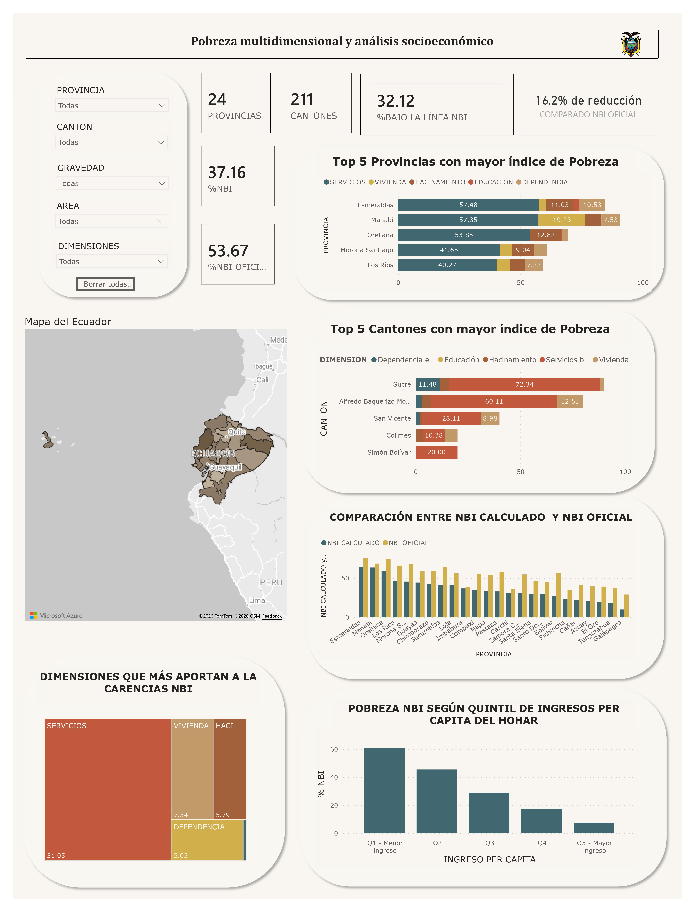

# INEC_NBI

## Descripción General

`INEC_NBI` es un proyecto de integración, calidad, gobierno y explotación analítica de datos construido en Qlik Talend Studio para el reto de Sector Público del Datatón Genius Lab III.

El proyecto consolida información oficial del Instituto Nacional de Estadística y Censos del Ecuador (INEC), principalmente datos de ENEMDU, codificación geográfica y tabulados oficiales de Necesidades Básicas Insatisfechas (NBI). La solución carga, valida y transforma los datos en Snowflake para habilitar análisis posteriores en Power BI y documentación de gobierno de datos en OpenMetadata.

El propósito funcional del proyecto es disponer de una base confiable para analizar indicadores relacionados con hogares, personas, territorios y pobreza por NBI, dejando trazabilidad sobre fuentes, procesos, reglas de calidad y tablas analíticas finales.

## Objetivo del Proyecto

El objetivo principal es construir un pipeline de datos reproducible que permita:

- Ingestar archivos oficiales del INEC desde fuentes CSV y Excel.
- Cargar información fuente en una capa `RAW` dentro de Snowflake.
- Preparar datos de referencia en una capa `REF`.
- Aplicar controles de calidad sobre los datos cargados.
- Construir estructuras intermedias y analíticas en capas `STG` y `MART`.
- Exponer resultados en dashboards de Power BI.
- Documentar linaje, fuentes y activos de datos en OpenMetadata.

## Alcance

El proyecto cubre el ciclo de vida completo del dato:

| Etapa | Herramienta / Capa | Descripción |
| --- | --- | --- |
| Ingesta | Talend Studio | Lectura de archivos CSV y Excel oficiales. |
| Persistencia inicial | Snowflake `RAW` | Almacenamiento de datos fuente con mínima transformación. |
| Referencias | Snowflake `REF` | Carga de catálogos geográficos y NBI oficial. |
| Preparación | Snowflake `STG` | Limpieza, normalización y preparación intermedia. |
| Modelo analítico | Snowflake `MART` | Construcción de dimensiones, hechos e indicadores para análisis. |
| Calidad de datos | Talend Data Quality / Joblets | Validación de completitud, consistencia y reglas de negocio. |
| Visualización | Power BI | Construcción de dashboards analíticos. |
| Gobierno de datos | OpenMetadata | Documentación de datasets, linaje, fuentes y activos. |

## Arquitectura de Datos

La arquitectura se organiza por capas para separar responsabilidades y facilitar trazabilidad:

| Capa | Descripción | Ejemplos |
| --- | --- | --- |
| `RAW` | Datos fuente cargados desde archivos originales. | `RAW.ENEMDU_PERSONAS`, `RAW.ENEMDU_VIVIENDA` |
| `REF` | Datos de referencia oficiales y catálogos. | `REF.DPA_ECUADOR`, `REF.NBI_OFICIAL_CANTON` |
| `STG` | Datos preparados, normalizados y listos para reglas de negocio. | Tablas intermedias generadas desde procedimientos Snowflake. |
| `MART` | Modelo analítico final para dashboard y consumo de negocio. | Dimensiones, hechos e indicadores NBI. |
| `DQ` | Resultados de calidad, registros rechazados y métricas. | Reglas ejecutadas desde `JOB_DQ` y `JL_DQ`. |

## Herramientas Utilizadas

| Herramienta | Uso dentro del proyecto |
| --- | --- |
| Qlik Talend Cloud Enterprise Edition 8.0.1 | Desarrollo de jobs ETL/ELT, lectura de fuentes, carga de Snowflake y control de calidad. |
| Snowflake | Almacenamiento, procesamiento SQL, capas RAW/REF/STG/MART y ejecución de procedimientos. |
| Talend Data Quality | Perfilamiento, análisis y reglas de calidad de datos. |
| Power BI | Creación de dashboards para visualización de indicadores de NBI y análisis territorial. |
| OpenMetadata | Gobierno de datos, documentación de activos, linaje, descripción de fuentes y trazabilidad. |
| Git | Versionamiento del proyecto Talend y documentación. |

## Fuentes Oficiales Seleccionadas

| Fuente | Archivo utilizado en el proyecto | Año | Página o enlace oficial | Uso dentro del proyecto |
| --- | --- | --- | --- | --- |
| ENEMDU Anual - Personas | `BDDenemdu_personas_2025_anual.csv` | 2025 | https://www.ecuadorencifras.gob.ec/enemdu-anual/ | Fuente principal para cargar información de personas en `RAW.ENEMDU_PERSONAS`. |
| ENEMDU Anual - Vivienda | `BDDenemdu_vivienda_2025_anual.csv` | 2025 | https://www.ecuadorencifras.gob.ec/enemdu-anual/ | Fuente principal para cargar información de viviendas y hogares en `RAW.ENEMDU_VIVIENDA`. |
| Codificación geográfica DPA / CGE | `CODIFICACIÓN_2026.xlsx` | 2026 | https://aplicaciones2.ecuadorencifras.gob.ec/SIN/descargas/cdpa2026.xlsx | Fuente de referencia para cargar provincias, cantones y parroquias en `REF.DPA_ECUADOR`. |
| Clasificador Geográfico Estadístico | `cge2026.xls` / referencia oficial complementaria | 2026 | https://aplicaciones2.ecuadorencifras.gob.ec/SIN/descargas/cge2026.xls | Referencia oficial para validar la estructura de codificación geográfica del país. |
| Tabulados oficiales de NBI | `nbi_oficial_inec_canton.xlsx` | 2025 | https://www.ecuadorencifras.gob.ec/documentos/web-inec/POBREZA/2025/Diciembre/Tabulados_NBI-dic25.xlsx | Fuente oficial de referencia para cargar valores de NBI en `REF.NBI_OFICIAL_CANTON`. |

## Estructura del Proyecto Talend

```text
INEC_NBI/
├── context/
│   └── context_inec/
├── joblets/
│   └── JL_DQ_0.1.item
├── metadata/
│   ├── fileDelimited/
│   │   └── inec_fuentes_csv/
│   └── fileExcel/
├── process/
│   └── inec/
├── TDQ_Data Profiling/
│   ├── Analyses/
│   └── Reports/
├── TDQ_Libraries/
│   ├── Rules/
│   ├── Patterns/
│   └── Indicators/
└── sqlPatterns/
```

## Inventario de Jobs

### Jobs Activos

| Job | Tipo | Propósito |
| --- | --- | --- |
| `JOB_PIPELINE_NBI` | Orquestador | Ejecuta el flujo principal de carga RAW y posterior procesamiento MART. |
| `J01_LOAD_RAW_PERSONAS` | Ingesta RAW | Carga el archivo de personas ENEMDU hacia `RAW.ENEMDU_PERSONAS`. |
| `J02_LOAD_RAW_VIVIENDA` | Ingesta RAW | Carga el archivo de viviendas ENEMDU hacia `RAW.ENEMDU_VIVIENDA`. |
| `J03_LOAD_REF_DPA` | Referencia | Carga codificación geográfica hacia `REF.DPA_ECUADOR`. |
| `J04_LOAD_REF_NBI_OFICIAL` | Referencia | Carga valores oficiales de NBI por cantón hacia `REF.NBI_OFICIAL_CANTON`. |
| `JOB_DQ` | Calidad de datos | Ejecuta reglas de validación, genera métricas y registra datos rechazados. |

### Jobs Históricos o Deshabilitados

| Job | Estado | Observación |
| --- | --- | --- |
| `J05_BUILD_STAGING` | Marcado como `deleted` | Representa una etapa planificada o histórica para construcción de staging. |
| `J06_BUILD_DIMENSIONS` | Marcado como `deleted` | Representa una etapa planificada o histórica para construcción de dimensiones. |

## Descripción Funcional de Jobs

### `JOB_PIPELINE_NBI`

Job principal del proyecto. Centraliza la ejecución del pipeline y se encarga de preparar la ejecución contra Snowflake.

Flujo principal:

1. Inicia el proceso con un mensaje de control.
2. Abre conexión a Snowflake mediante variables de contexto.
3. Ejecuta `TRUNCATE TABLE RAW.ENEMDU_PERSONAS`.
4. Ejecuta `TRUNCATE TABLE RAW.ENEMDU_VIVIENDA`.
5. Ejecuta `J01_LOAD_RAW_PERSONAS`.
6. Ejecuta `J02_LOAD_RAW_VIVIENDA`.
7. Ejecuta el procedimiento `CALL MART.SP_LOAD_ALL_MART_NBI();`.
8. Cierra conexión con Snowflake.

### `J01_LOAD_RAW_PERSONAS`

Job de ingesta de personas ENEMDU.

| Elemento | Detalle |
| --- | --- |
| Entrada | `BDDenemdu_personas_2025_anual.csv` |
| Formato | CSV delimitado por `;` |
| Codificación | UTF-8 |
| Transformación | Mapeo de campos mediante `tMap` |
| Salida | `RAW.ENEMDU_PERSONAS` |

### `J02_LOAD_RAW_VIVIENDA`

Job de ingesta de viviendas y hogares ENEMDU.

| Elemento | Detalle |
| --- | --- |
| Entrada | `BDDenemdu_vivienda_2025_anual.csv` |
| Formato | CSV delimitado por `;` |
| Codificación | UTF-8 |
| Transformación | Mapeo de campos mediante `tMap` |
| Salida | `RAW.ENEMDU_VIVIENDA` |

### `J03_LOAD_REF_DPA`

Job de carga de referencia geográfica.

| Elemento | Detalle |
| --- | --- |
| Entrada | `CODIFICACIÓN_2026.xlsx` |
| Hoja | `CODIGOS` |
| Transformación | Renombrado y estandarización de provincia, cantón y parroquia |
| Filtro | Elimina filas sin código de provincia |
| Salida | `REF.DPA_ECUADOR` |

### `J04_LOAD_REF_NBI_OFICIAL`

Job de carga de referencia oficial NBI.

| Elemento | Detalle |
| --- | --- |
| Entrada | `nbi_oficial_inec_canton.xlsx` |
| Hoja | `NBI_Normalizado` |
| Transformación | Conversión del porcentaje NBI a valor numérico estandarizado |
| Salida | `REF.NBI_OFICIAL_CANTON` |

### `JOB_DQ`

Job de calidad de datos.

Funciones principales:

- Genera identificador de ejecución `run_id`.
- Genera fecha/hora de ejecución `run_ts`.
- Consulta datos desde Snowflake.
- Evalúa reglas de calidad sobre tablas RAW.
- Envía resultados al joblet `JL_DQ`.
- Registra métricas y rechazados.

## Joblet de Calidad

### `JL_DQ`

`JL_DQ` es un joblet reutilizable para centralizar el tratamiento de resultados de calidad.

Responsabilidades:

- Recibir registros que incumplen reglas de calidad.
- Registrar razón del error.
- Registrar identificador de regla.
- Registrar dimensión de calidad afectada.
- Registrar severidad del error.
- Consolidar métricas de evaluación.

## Reglas y Dimensiones de Calidad

El proyecto incorpora controles de calidad asociados a dimensiones como:

| Dimensión | Ejemplos de validación |
| --- | --- |
| Completitud | Campos clave no nulos, como identificadores de hogar. |
| Validez | Valores numéricos válidos, pesos de expansión y formatos esperados. |
| Consistencia | Coherencia entre datos de vivienda, hogar y geografía. |
| Unicidad | Identificadores y claves de negocio sin duplicidades no esperadas. |
| Trazabilidad | Registro de `run_id`, `run_ts`, dataset, regla y motivo de rechazo. |

## Metadata

La carpeta `metadata` contiene definiciones reutilizables de archivos y esquemas de lectura.

### Metadata CSV

| Metadata | Uso |
| --- | --- |
| `metadata/fileDelimited/inec_fuentes_csv/personas_0.1.item` | Esquema de lectura para archivo de personas ENEMDU. |
| `metadata/fileDelimited/inec_fuentes_csv/viviendas_0.1.item` | Esquema de lectura para archivo de viviendas ENEMDU. |

### Metadata Excel

| Metadata | Uso |
| --- | --- |
| `metadata/fileExcel/dpa_0.1.item` | Esquema para lectura del catálogo DPA. |
| `metadata/fileExcel/nbi_oficial_0.1.item` | Esquema para lectura de tabulados oficiales NBI. |
| `metadata/fileExcel/nbi_ofiical_0.1.item` | Asset adicional relacionado con NBI oficial. |

## Talend Data Quality

El proyecto incluye activos de perfilamiento y reglas de calidad dentro de `TDQ_Data Profiling` y `TDQ_Libraries`.

### Análisis de Perfilamiento

| Asset | Descripción |
| --- | --- |
| `ENEMDU_2025_Personas_Profile_Min_v2` | Perfilamiento mínimo del dataset de personas ENEMDU. |
| `ENEMDU_2025_Viviendas_Profile_Min` | Perfilamiento mínimo del dataset de viviendas ENEMDU. |

### Reportes de Calidad

| Reporte | Descripción |
| --- | --- |
| `Reporte_ENEMDU_2025_Personas_Profile` | Reporte de perfilamiento para personas. |
| `Reporte_ENEMDU_2025_Viviendas_Profile` | Reporte de perfilamiento para viviendas. |

### Librerías TDQ

| Carpeta | Uso |
| --- | --- |
| `TDQ_Libraries/Rules/SQL` | Reglas SQL de calidad. |
| `TDQ_Libraries/Patterns` | Patrones de validación reutilizables. |
| `TDQ_Libraries/Indicators` | Indicadores estándar de calidad y perfilamiento. |

## Contexto de Ejecución

El proyecto utiliza el contexto `context_inec` para parametrizar rutas y credenciales.

| Variable | Descripción |
| --- | --- |
| `inec_path` | Ruta base donde se ubican los archivos fuente. |
| `account` | Cuenta de Snowflake. |
| `user_id` | Usuario de Snowflake. |
| `password` | Contraseña o secreto de conexión. |
| `warehouse` | Warehouse de Snowflake. |
| `database` | Base de datos destino. |
| `run_id` | Identificador único de ejecución. |
| `run_ts` | Fecha/hora de ejecución. |

Ejemplos configurados:

| Variable | Valor de referencia |
| --- | --- |
| `inec_path` | `C:/fuentes_inec/` |
| `database` | `NBI_DB` |
| `warehouse` | `COMPUTE_WH` |

## Tablas Principales en Snowflake

| Capa | Tabla | Descripción |
| --- | --- | --- |
| `RAW` | `ENEMDU_PERSONAS` | Datos fuente de personas ENEMDU. |
| `RAW` | `ENEMDU_VIVIENDA` | Datos fuente de viviendas y hogares ENEMDU. |
| `REF` | `DPA_ECUADOR` | Catálogo geográfico oficial. |
| `REF` | `NBI_OFICIAL_CANTON` | Valores oficiales de NBI por cantón. |
| `MART` | `SP_LOAD_ALL_MART_NBI` | Procedimiento que construye o actualiza la capa analítica final. |

## Power BI

Power BI se utiliza como herramienta de visualización del proyecto.

Los dashboards se alimentan desde las estructuras analíticas preparadas en Snowflake, principalmente desde la capa `MART`.

Objetivos del dashboard:

- Visualizar indicadores de NBI por provincia, cantón o territorio.
- Comparar resultados calculados con referencias oficiales.
- Identificar zonas con mayores niveles de pobreza por NBI.
- Presentar métricas de hogares, viviendas y personas de forma ejecutiva.

Captura del dashboard analítico desarrollado en Power BI:



## OpenMetadata

OpenMetadata se utiliza para gobierno de datos.

Usos dentro del proyecto:

- Documentación de fuentes oficiales.
- Registro de datasets de entrada y salida.
- Descripción de tablas RAW, REF, STG y MART.
- Documentación del linaje desde archivo fuente hasta tabla analítica.
- Soporte para trazabilidad de reglas de calidad.

## Flujo de Ejecución Recomendado

1. Verificar que los archivos fuente existan en la ruta `inec_path`.
2. Validar conexión a Snowflake mediante el contexto `context_inec`.
3. Ejecutar `J03_LOAD_REF_DPA` para cargar referencias geográficas.
4. Ejecutar `J04_LOAD_REF_NBI_OFICIAL` para cargar NBI oficial.
5. Ejecutar `JOB_PIPELINE_NBI` para cargar datos RAW y preparar MART.
6. Ejecutar `JOB_DQ` para validación de calidad.
7. Verificar tablas resultantes en Snowflake.
8. Actualizar o refrescar dashboards en Power BI.
9. Documentar activos, linaje y resultados en OpenMetadata.

## Requisitos de Ejecución

- Tener instalado o disponible Qlik Talend Studio compatible con el proyecto.
- Contar con acceso a Snowflake.
- Tener configuradas las variables del contexto `context_inec`.
- Ubicar los archivos fuente en la ruta definida por `inec_path`.
- Contar con permisos sobre esquemas `RAW`, `REF`, `STG`, `MART` y tablas de calidad.
- Contar con acceso a Power BI para consumo de dashboards.
- Contar con acceso a OpenMetadata para documentación y gobierno.

## Resultado Esperado

Al finalizar la ejecución del proyecto se espera contar con:

- Datos ENEMDU de personas cargados en `RAW.ENEMDU_PERSONAS`.
- Datos ENEMDU de viviendas cargados en `RAW.ENEMDU_VIVIENDA`.
- Catálogo geográfico cargado en `REF.DPA_ECUADOR`.
- Valores oficiales NBI cargados en `REF.NBI_OFICIAL_CANTON`.
- Datos procesados en capas `STG` y `MART`.
- Reglas de calidad ejecutadas y trazables.
- Dashboard disponible en Power BI.
- Activos documentados en OpenMetadata.

## Notas Técnicas

- `JOB_PIPELINE_NBI` es el punto de entrada principal para la carga operativa.
- `JOB_DQ` debe ejecutarse después de tener datos cargados en Snowflake.
- La preparación final de `MART` se realiza mediante el procedimiento `MART.SP_LOAD_ALL_MART_NBI()`.
- Los enlaces de fuentes oficiales deben verificarse antes de una nueva ejecución, ya que los portales públicos pueden cambiar rutas o nombres de archivo.
